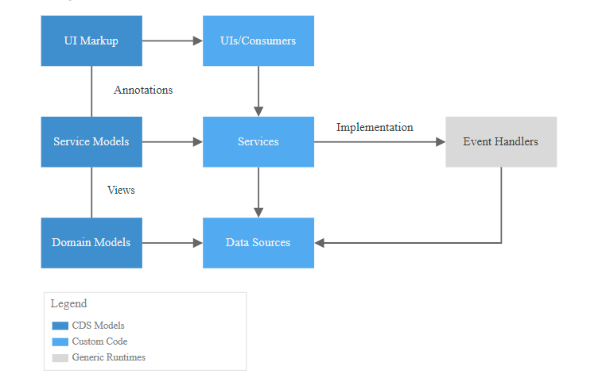

# Get Started with SAP Cloud Application Programming (CAP), SAP Fiori, and SAP HANA Cloud

## Description

The goal of this mission is to create a basic CAP application using data model, service and a Fiori application in SAP Business Application Studio.

You will extend the CAP application and the Fiori to get a basic bookshop application.

Optionally, you can deploy the application to on SAP Business Technology Platform (BTP) Cloud Foundry, using SAP HANA Cloud and HTML5 Repository from SAP Build Work Zone service. Once deployed on HANA cloud, you can use the backend database for hybrid testing.

[Read More..](https://github.com/dpk-bhat/test-repo/edit/main/README.md)

### Additional Context

Part of the SAP partners ecosystem is built on multitenant applications based on SAP BTP, Kyma runtime. The goal of these applications is to extend the functionality of the SAP solutions, such as SAP S/4HANA Cloud, and to solve customers&#8217; specific business requirements.

### Challenges and Business Drivers

You want to use SAP Cloud Application Programming (CAP) with SAP Fiori, and SAP HANA Cloud

### Solutions

Create a basic CAP application using data model, service and a Fiori application in SAP Business Application Studio. You will extend the CAP application and the Fiori to get a basic bookshop application.

### Benefits
Learn how to develop CAP applications and deploy them to SAP BTP Cloud Foundry

## General Information
|Fields|Values|
|---|---|
|Source|Customer Engagement Executives, Customer Innovation and Maintenance|
|SAP Process|Recruit to Retire|
|Product Category|Business Technology Platform, Application Development and Automation, Integration|
|Industries|Software Providers|
|Lines of Business|IT Management|
|Focus Topics|GROW with SAP, Extensibility|
|Tags|odata, nodejs, sap-btp|

## Internal Information

### Business Questions
Rapid Front-End Development SAP Build offers a low-code platform that enables developers to design and develop the front-end user interface (UI) of applications. With its intuitive drag-and-drop interface, developers can easily create screens, define navigation flows, and add business logic without the need for extensive coding. This streamlines the development process, allowing developers to focus on crafting exceptional user experiences.

### Technical Questions
Powerful Back-End Development SAP CAP, short for Cloud Application Programming Model, provides a comprehensive framework for building cloud-native applications on SAP Cloud Platform. As an expert, you can leverage SAP CAP to develop robust back-end services and business logic for your applications. The programming model simplifies the development process by offering standardized patterns and tools for defining data models, implementing server-side logic, and exposing APIs.

### Additional Comments
Remember, as an expert, it’s essential to consult the official documentation of both SAP Build and SAP CAP for the latest updates and guidelines. Your expertise and understanding of these tools will play a vital role in adapting and configuring your development processes to suit your specific project requirements.

### Maturity Level
Use Case based on a Dedicated PoC

### Deployment Effort
30-80 days

### Competitive Differentiation
Low

### Buyer Persona
Chief Customer Officer, Maintenance Director

### Customer Type
Active

### Customer Segment
Key Accounts

## Services

| Service       | Optional      |
| ------------- |:-------------:|
| SAP Business Application Studio|  |
| SAP Build Apps|  |
| SAP BTP, Cloud Foundry Runtime| optional |
| Azure ML | |

## External Information

### Mission Effort
2-4 days

### Mission Prerequisites
Mission Prerequisites

## Guided Answers
- [Where can I find some sample projects?](https://github.com/SAP-samples/cloud-cap-samples)
- [Where can I find some tutorial links?](https://developers.sap.com/tutorial-navigator.html?tag=software-product-function%3Asap-cloud-application-programming-model&tag=tutorial%3Atype%2Fmission)
- [How to clear an interview?](https://www.geeksforgeeks.org/top-10-algorithms-in-interview-questions/)

## FAQs
1.   - Node JS to OData serivce using SAP Destination Method
     - Using the destination in a nodejs applications requires a binding to a destination service. If the destination is pointing to an on premise system we have to connect to this service via the cloud connector. To call a service over the cloud connector we have to adapt our proxy settings in our http client. To read the configuration of the proxy and the authentication information, we need to bind our application to a connectivity service.

2.   - Axios with destinations
     - To keep the use of axios as close as possible to the standard. I decided to create an axios instance for each destination. For each destination a request interceptor will override the data in the AxiosRequestConfig object with the configuration in the destination before starting the request.

## Solution Diagram

